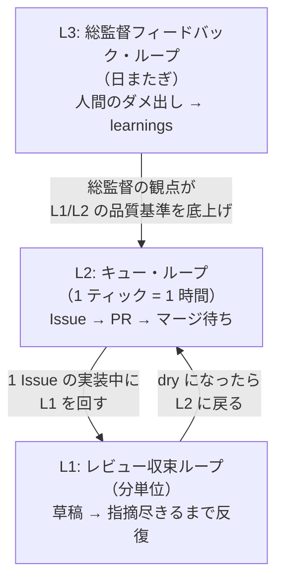
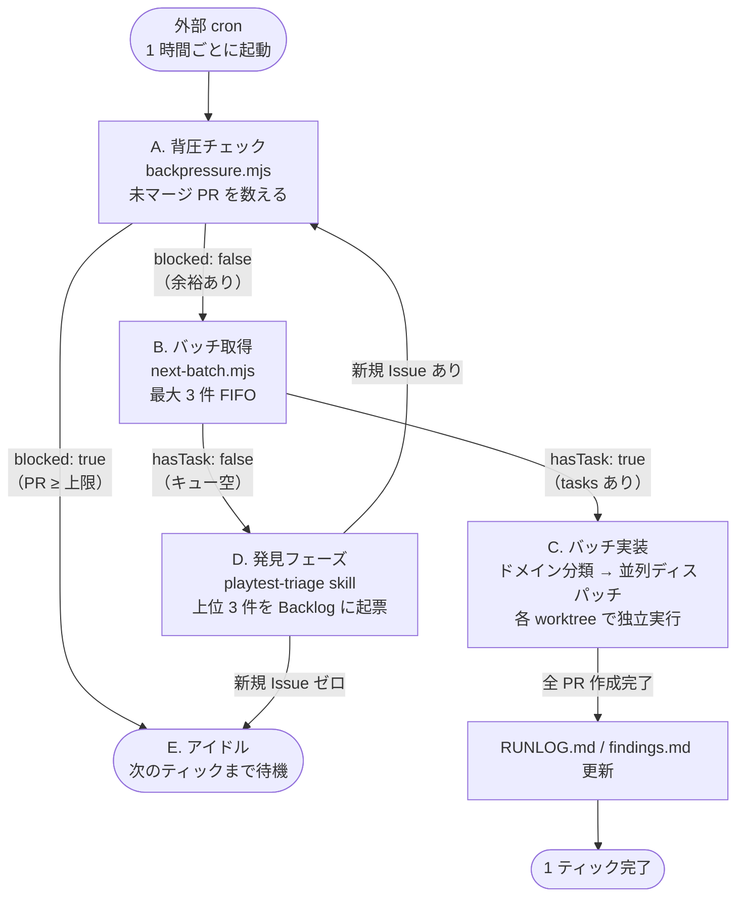
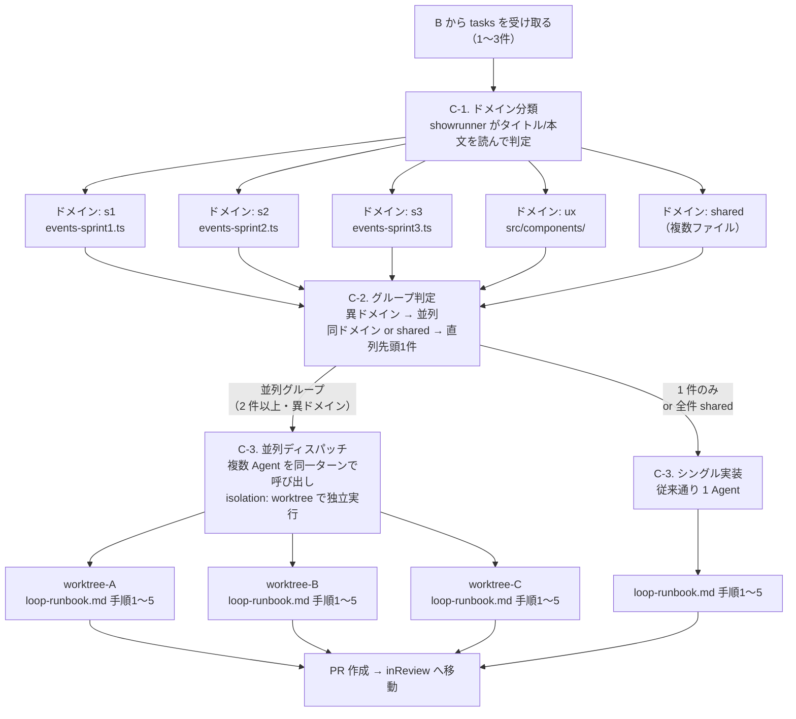
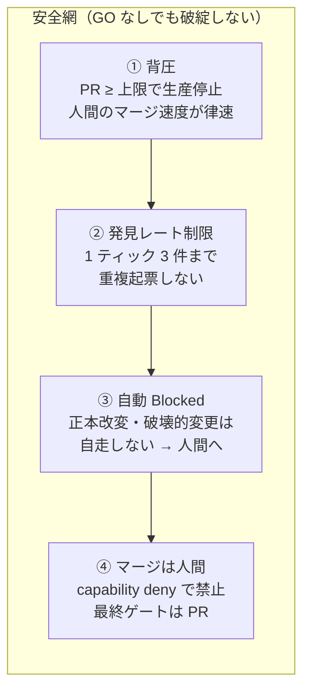
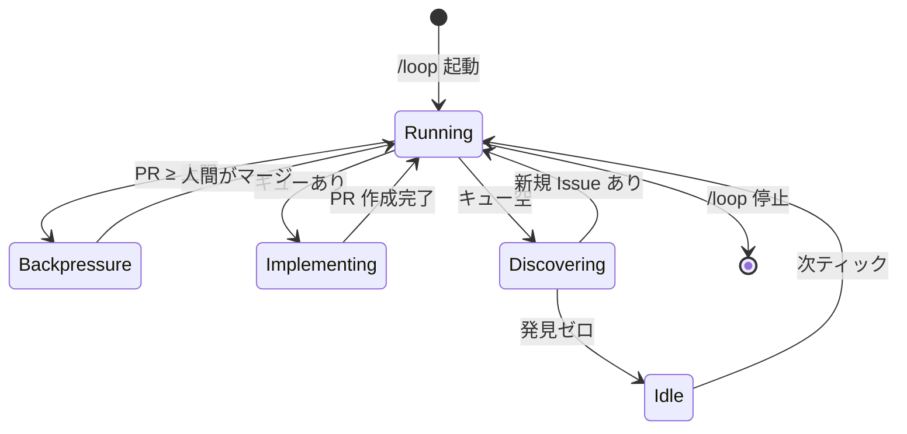

# LOOP_ARCHITECTURE.md — 自己改善ループの設計図

このドキュメントは、FDE Agile Quest が「夜の間に自律的に磨かれる」仕組みの設計を
**Mermaid ダイアグラム付きで俯瞰する**ためのもの。
実装の正本は `.claude/agents/loop-autonomous-playtest.md`（1ティックの動作）と
`.claude/agents/loop-runbook.md`（1 Issue の実装 SOP）。

---

## 1. マクロ構造：3 層の改善ループ

- **L1（分単位）**: 草稿 1 件を「🔴 ゼロ」まで磨く。権限分離（書く=maker / 見る=checker）で自己追認禁止。
- **L2（1 ティック）**: Issue をキューから拾い、PR まで運ぶ。背圧で暴走防止。
- **L3（日またぎ）**: 人間の指摘を `learnings/<agent>.md` へ一般化し、次回以降の基準を底上げ。

---

## 2. 1 ティックの動作フロー（A → E）

---

## 3. C フェーズ詳細：並列バッチ実装

最大 3 件の Issue を「ファイル競合しない組」に分けて並列実装する。

### ドメイン分類キーワード早見表

| ドメイン | タイトルに含まれるキーワード | 主なファイル |
|---|---|---|
| `s1` | `s1-` / `Sprint1` / `S1` のみ | `events-sprint1.ts` |
| `s2` | `s2-` / `Sprint2` / `S2中盤` / `S2後半` | `events-sprint2.ts` |
| `s3` | `s3-` / `Sprint3` / `S3` のみ | `events-sprint3.ts` |
| `ux` | `ResultModal` / `コンポーネント` / `UI` / `画面` / `操作感` / `a11y` | `src/components/` |
| `shared` | 複数スプリントをまたぐ / 上記に当てはまらない | 複数ファイル |

---

## 4. 暴走防止の三層

---

## 5. ループの収束と停止

収束トリガー:
- **背圧で止まる**: `In review` の PR が上限に達したらアイドル（人間のマージ待ち）
- **キューと発見が枯れる**: やることが何もなければ長めのアイドル
- **手動停止**: 総監督が `/loop` を止めたとき

---

## 6. 関連ファイル一覧

| ファイル | 役割 |
|---|---|
| `.claude/agents/loop-autonomous-playtest.md` | 1 ティックの動作正本（**このドキュメントの実装元**） |
| `.claude/agents/loop-runbook.md` | 1 Issue を実装する SOP（L1 + L2 の手順書） |
| `.claude/agents/loop/next-batch.mjs` | キューから最大 N 件を返すスクリプト |
| `.claude/agents/loop/next-auto.mjs` | キューから 1 件を返すスクリプト（単体実行用） |
| `.claude/agents/loop/backpressure.mjs` | 背圧チェックスクリプト |
| `.claude/agents/loop/config.json` | 上限・バッチサイズ等の設定 |
| `.claude/agents/ledger/RUNLOG.md` | ティックごとの作業記録（朝の引き継ぎ） |
| `.claude/agents/ledger/findings.md` | 非ブロッキング指摘の持ち越し台帳 |
| `docs/SELF_IMPROVEMENT.md` | 3 層ループの概念説明（入口ドキュメント） |
| `.claude/agents/loop-meta-engineer.md` | ループ構造の自己改善エージェント（メタ改善担当） |
| `.claude/skills/loop-meta/SKILL.md` | 単発でループ構造を診断・修正するスキル |

> **このファイルは設計図（地図）であって正本ではない。**
> 正本は各 `.claude/agents/*.md` とスクリプト群。実装が変わったらここを追従する。
